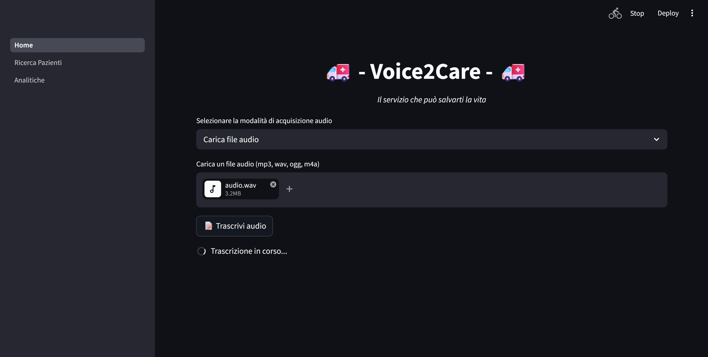

# BigData - Voice2Care
Creazione di uno strumento per automatizzare il processo di creazione di un report clinico, utilizzando un LLM.



Un operatore sanitario invece di dover compilare manualmente un report clicino, utilizza un modello in grado di:
- convertire la propria voce in testo;
- verificare la correttezza dei dati;
- generare un report clinico (PDF).

Dalla web application, l'operatore è in grado di visualizzare i pazienti oppure visualizzare analitiche su di essi.

## Setup
Impostare le seguenti variabili d'ambiente:
```
DB_URI = <db_uri>
API_KEY = <api_key>
FFMPEG_PATH = <ffmpeg_path>
```

Si consiglia di utilizzare un ambiente virtuale:
```
python -m venv venv
```

Si ottiene una struttura di questo tipo:
```
venv/
|
|___ect/
|___Include/
|___Lib/
|___Scripts/
|   |
|   |___client/
|   |___server/
|   |___shared/
|___share/
|___pyenv.cfg
requirements.txt
```

Installare le dipendenze:
```
pip install -r requirements.txt
```

Avviare il servizio con:
```
streamlit run client/Home.py
```